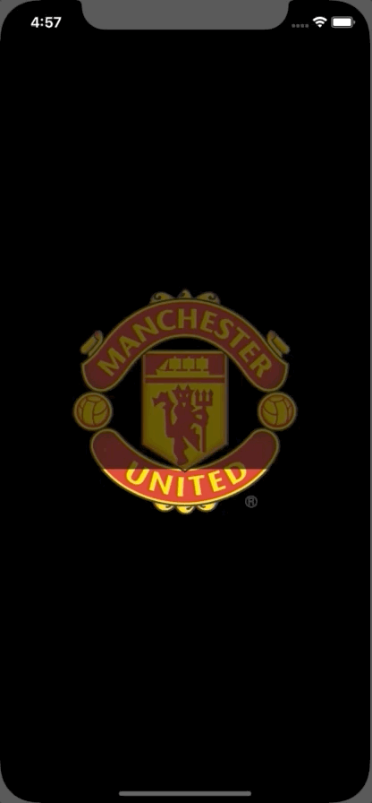

# GNImageProgressBar


<a href="https://developer.apple.com/swift"></a>
<a href="https://github.com/nicolaouG/GNImageProgressBar/blob/master/LICENSE"></a>

Show progress with an image.




## Getting started
```
platform :ios, '10.0'

pod 'GNImageProgressBar'
```

## How to use

You can have a look at the demo project for a simple use case (ExampleViewController).

Currently, only one fill direction is supported:
```swift
let imageProgressBar = GNImageProgressBar(image: myImage, size: desiredSize, backgroundImageAlpha: myAlpha, shouldShowBackgroundImage: true, fillDirection: .fromBottom, progress: 0.3)
```
or just
```swift
let imageProgressBar = GNImageProgressBar(image: myImage, size: desiredSize, fillDirection: .fromBottom)

// view.addSubview(imageProgressBar)
// setup constraints or frame

imageProgressBar.setProgress(progress, animated: true)
```


